# git 基本功能

### github上仓库的创建

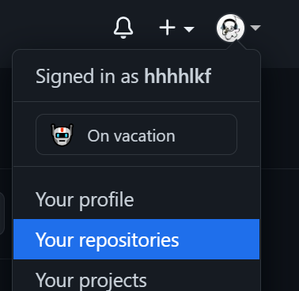


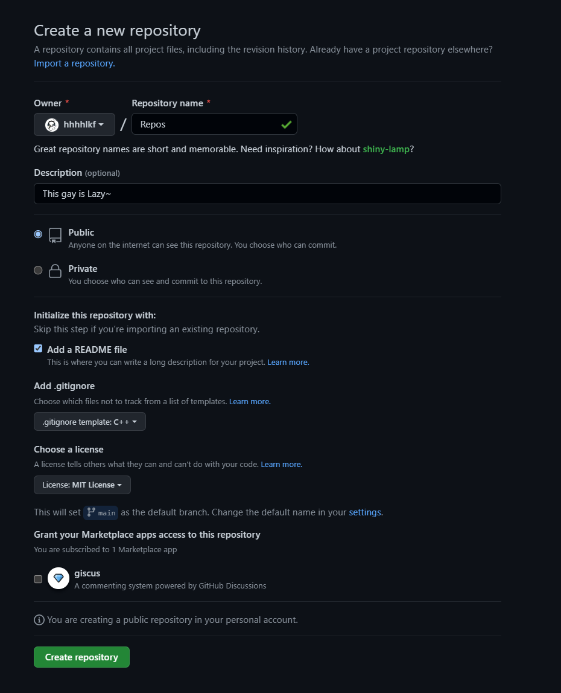

其中必填name、其他选填（建议加上.gitignore和README file）

### 创建后拷回本地

```shell
git clone git@github.com:hhhhlkf/redbase.git
```

或者：

```shell
git clone https://github.com/hhhhlkf/redbase.git
```

建议自己先配置一个SSH密钥，可以一定程度上防止远程仓库出现网络响应问题

### git bash下非冲突的版本更新

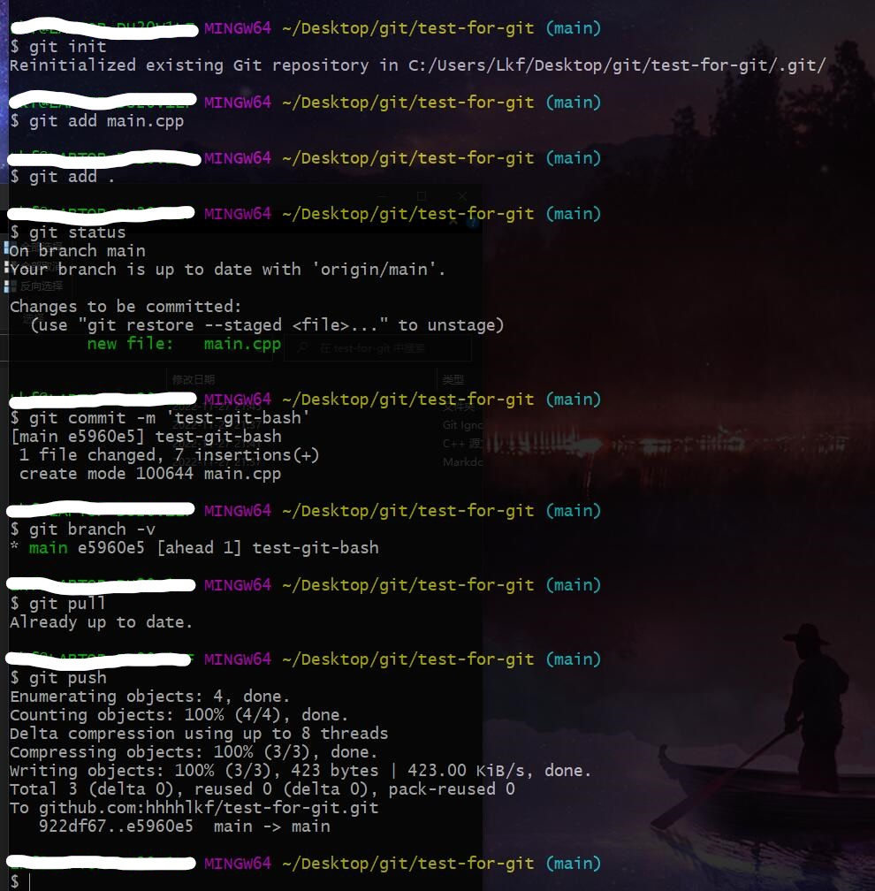

关键步骤为：

```shell
git add .
git commit -m '提交'
git pull
git push
```

可能会有git push不上去master的情况，这时候可以按照人家的指示来，输入下方命令之类的：

```shell
git push -u origin master
```

### vscode 下非冲突版本更新

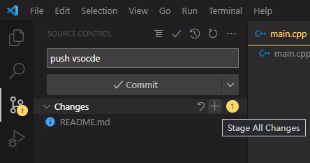


1. 需要点击Changes的加号进行add操作
2. 需要输入字段作为commit 标识
3. 点击commit 进行提交
4. 点击Sync Changes 进行 pull和push

### idea 下非冲突版本更新

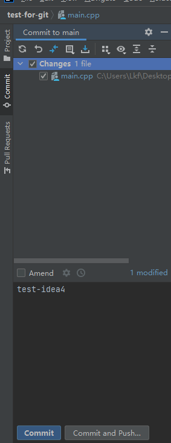

可以进行add 和 commit 操作

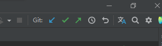

可以进行 pull 和 push 操作

### vscode下的冲突更新

在当前本地版本与远程仓库最新版本的某些文件存在不一致的修改时，当前本地仓库在进行pull的时候会发生冲突。

当前本地版本：

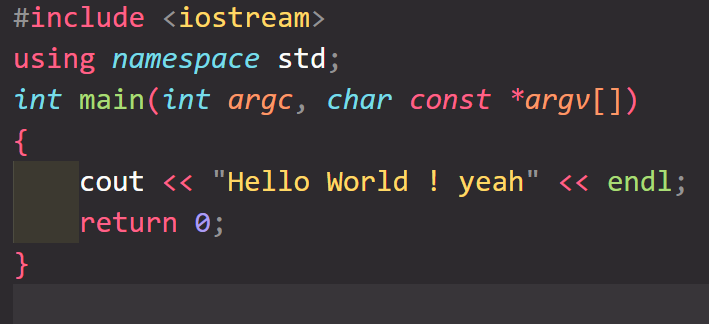

当前仓库版本：

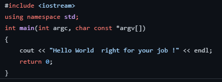

进行commit后，尝试点击Sync Changes进行pull和push。就会出现冲突提醒

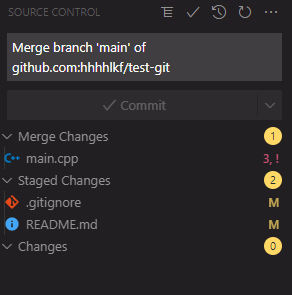

其中存在!的文件就是存在冲突的文件。点击进入。

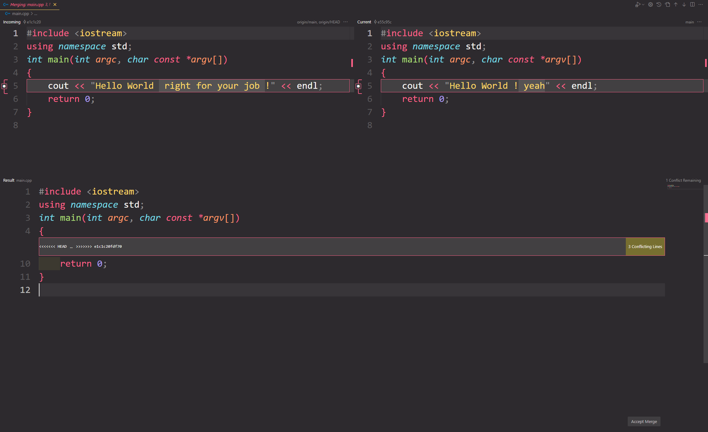

其中，左边是remote版本，右边是current版本，下面是最后的merge结果。

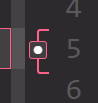

点击该按钮可以进行选择合并，最后也可以在下方的合并浏览里修改，的到最后的合并结果。

点击右下角Accept Merge之后就可以合并了，合并后就可以commit pull push了。

提交后分支图（需要下git history插件）：

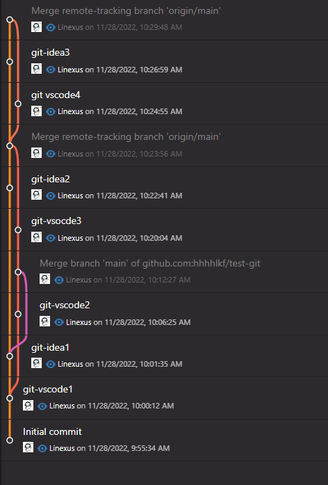

### IDEA下的冲突更新

同vscode,在当前本地版本与远程仓库最新版本的某些文件存在不一致的修改时，当前本地仓库在进行pull的时候会发生冲突。

远端版本：

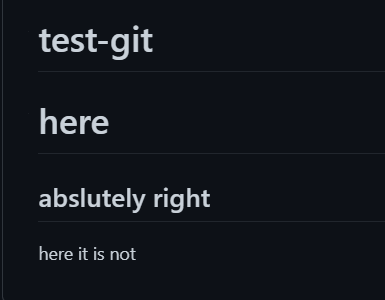

本地版本：
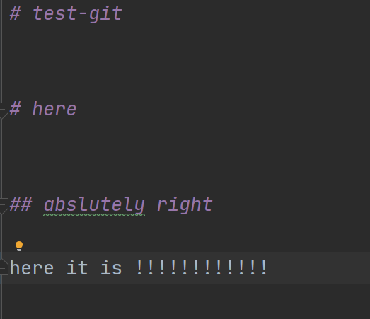

进行commit后，尝试点击pull。就会出现冲突提醒:

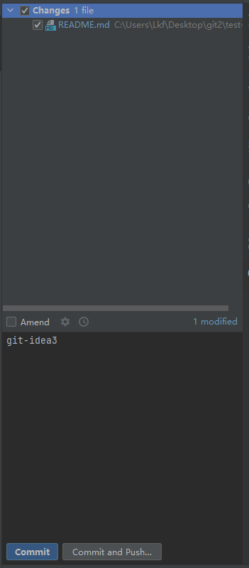

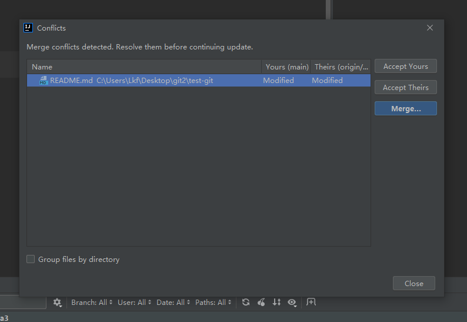

可以选择Merge进行合并

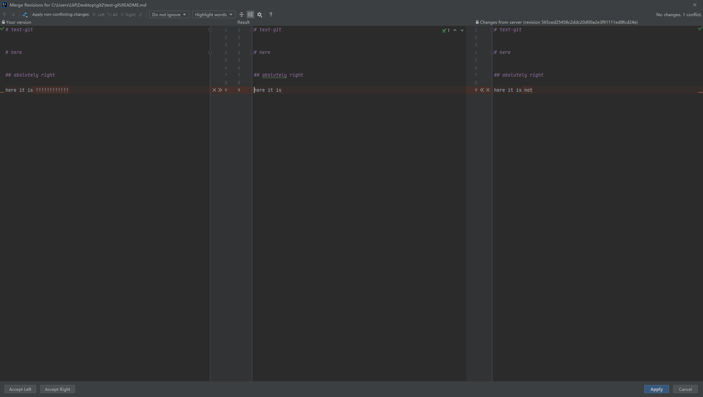

左边作为本地，右边作为远端，中间是Merge后的结果，也可以在merge的基础上进行修改。

Merge后可以点击Apply进行提交。之后就可以push了。

未提交前分支图：

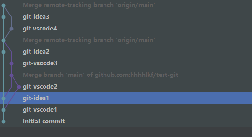

提交后分支图：

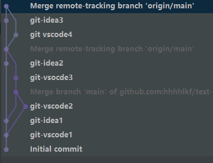

### vscode新建本地分支和分支合并

在日常开发过程中，某几个小组成员可能需要花很长的时间开发一部分组件，该部分组件与其他组员的程序耦合性较低，因此可以选择重新开辟另一个分支进行开发，开发完成之后就可以合并到主分支上，避免了每次都需要合并而产生的不必要的麻烦。

点击左下角带有git符号的main：

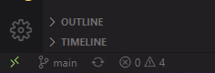

上方窗口便会显示：

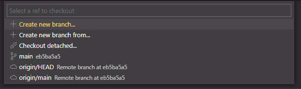

点击Create new branch就会以当前所处分支作为基础，进行本地新分支的创建。输入名字后即可创建成功。


表名其处于dev分支中。

在本地dev分支开发完毕后，开始准备将其合并到main分支。

1. 在dev上进行commit操作。
2. 切换回main分支(同样点击带有git符号的dev)
3. 进行Merge操作

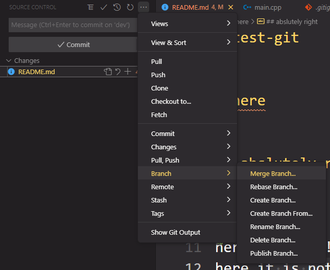

选择本地dev(也可选择远端的dev分支)

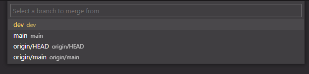

即可同步成功，可能会出现冲突，冲突解决与之前完全一致，不再过多赘述。

​	4.最后进行pull和push(由于dev版本已经commit过了，所以就不用commit了)

### IDEA新建本地分支和分支合并

右下角携带git图标的main点击新建分支：

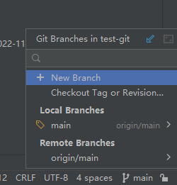

输入名字：

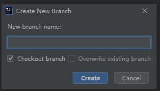

新建分支完毕后可以进行开发了。

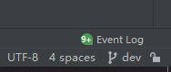

当前表明处于dev分支

在本地dev分支开发完毕后，开始准备将其合并到main分支。

1. 在dev上进行commit操作。

2. 切换回main分支(同样点击带有git符号的dev)

   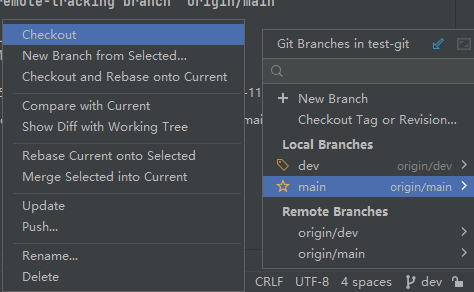

3. 进行Merge操作(选择已经commit过的dev进行合并)

   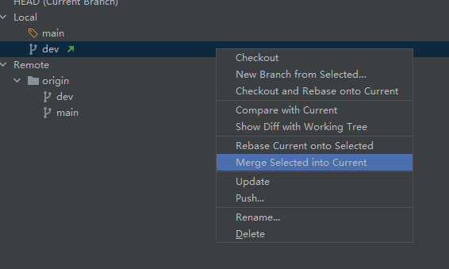

4. 最后进行pull和push(由于dev版本已经commit过了，所以就不用commit了)


### 删除操作

```shell
git rm -r --cached xxx
git commit -n 'del xxx'
git pull
git push
```

--cached是保留本地文件，删除远端文件的意思。

